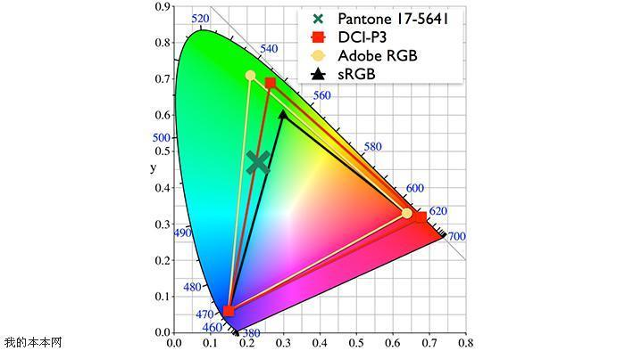
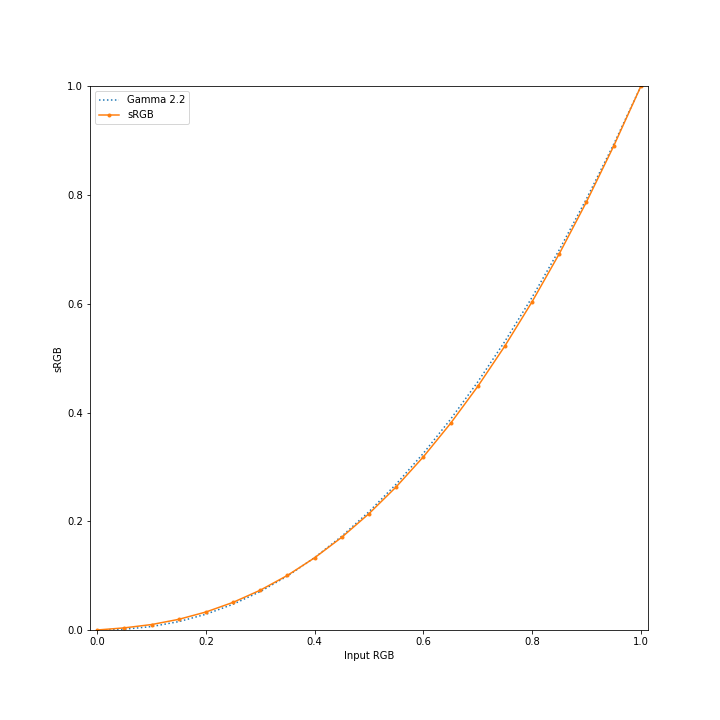

# VFXGallery
***

### WebGL VFX Gallery

---

[smoke fluid](./sf.html)

[gradient fluid](./gf.html)

### sRGB 与 Display-P3 ( 苹果 P3 ) 的关系

---

###### 三点结论：

1. 苹果公司的Display-P3是一种折衷的标准，它的光照映射（包括白色参考点D65的选择，和亮度变换（通常用gamma变换实现））与sRGB一致，但是色域的选择又与DCI-P3一致。

   这使得sRGB内容直接显示在P3屏幕上也不会太糟糕，因为人眼对亮度更敏感，对颜色相对没有那么敏感。如果不做变换，sRGB的图像直接显示在P3的屏幕上会出现颜色过饱和的问题。比如，绿色显示的比实际的更绿，因为显示的时候sRGB的元绿色被强行显示为P3色域的元绿色，而P3色域是比sRGB要大，涵盖了更绿的绿色。这一点从下面的色域图可以看出。

2. sRGB 的亮度映射不是gamma 2.2但是非常接近，工程上认为没有区别。

sRGB标准规定的变换函数：
$$
y=\left\{  
             \begin{array}{**lr**}  
              \frac{x}{12.92}&x \leq 0.0031308  \\  
             
              (\frac{x+0.055}{1.055})^{2.4}&x > 0.0031308    
             \end{array}  
\right.
$$
gamma 2.2 变换函数:
$$
y = x^{2.2}
$$

sRGB标准之所以定义一个线性的分段是为了让对应的gamma校正变换在0处的斜率不是无穷大。

两者的差异如下图所示：

3. sRGB 到 Display-P3需要做的变换如下：

sRGB -> gamma变换（非线性，指数运算）-> 线性光照的sRGB色域 ->色域变换（线性变换）-> 线性光照的P3色域  ->gamma校正变换（非线性，指数运算）->Display P3。在确定位宽的情况下，以上变换特别是gamma与gamma校正变换应当考虑用查表方式来加速实现而不是对每张图都逐点的做浮点运算，否则指数运算会太慢。另外，我认为这样的逐像素点变换照常理而言，GPU实现一定比CPU实现要快，否则很可能实现方法本身有问题。

主要参考依据：

[苹果开发手册中的Display-P3](https://developer.apple.com/documentation/coregraphics/cgcolorspace/1408916-displayp3)

[维基百科介绍DCI-P3](https://en.wikipedia.org/wiki/DCI-P3)

[维基百科介绍sRGB](https://en.wikipedia.org/wiki/SRGB)

